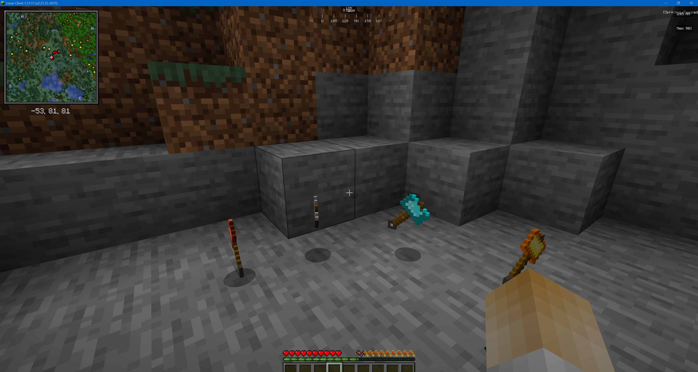
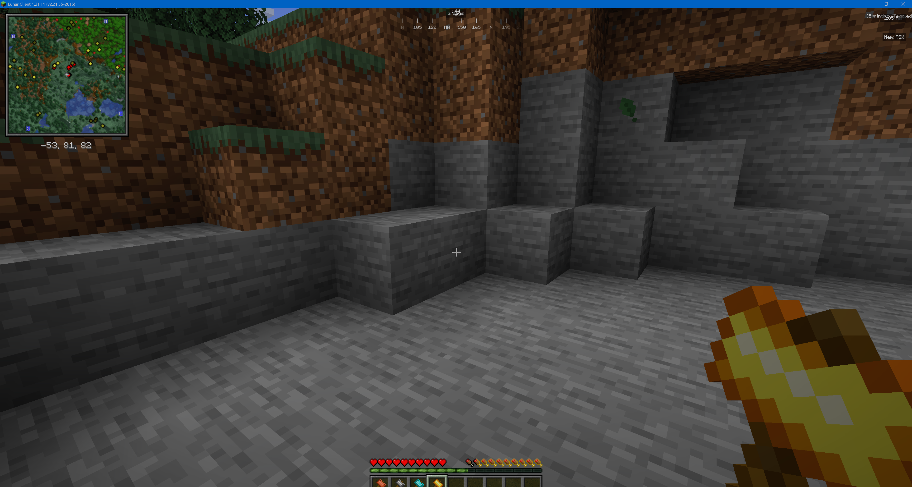

# MC Ham (Minecraft Fabric Mod)

<p align="center">
  
</p>

MC Ham ist ein Fabric-Mod fuer Minecraft 1.21.11 und fuegt mehrere starke Hammer als Multi-Tool hinzu.

- Projektseite: https://alexsagarra.github.io/mc_ham/
- Repository: https://github.com/alexsagarra/mc_ham
- Mod ID: mc_hammer

## Features

- Multi-Tool Mining (Pickaxe, Axe, Shovel, Sword-Mineables)
- 3er-Abbau: Zentrum + links + rechts
- Verzauberbar wie normale Tools
- Mehrere Hammer-Typen: Kupfer, Eisen, Gold, Diamant, Obsidian
- Obsidian-Hammer mit Spezialeffekt:
  - Blitz auf Trefferposition
  - zusaetzliche Zerstoerung von 2 bis 5 Bloecken in der Umgebung

## Kompatibilitaet

- Minecraft: 1.21.11
- Loader: Fabric
- Java: 21+
- Empfohlen: Fabric API

## Installation (Client)

1. Fabric Loader fuer 1.21.11 installieren.
2. Mod-JAR herunterladen (Release-Seite).
3. JAR in den Mods-Ordner kopieren:

```text
%APPDATA%/.minecraft/mods
```

4. Minecraft mit Fabric-Profil starten.

## Installation (Server / Aternos)

1. Server stoppen.
2. Software auf Fabric setzen.
3. Mod und Fabric API installieren.
4. Server starten.
5. Wichtig: Client und Server muessen dieselbe Mod-Version nutzen.

## Download

- Releases: https://github.com/alexsagarra/mc_ham/releases
- Projektseite mit Anleitung/Media: https://alexsagarra.github.io/mc_ham/

## Development

### Build

```powershell
./gradlew build
```

### Dev Client

```powershell
./gradlew runClient
```

### Hilfsskripte (Windows)

```powershell
./scripts/go.ps1 -Command build
./scripts/go.ps1 -Command run
./scripts/go.ps1 -Command build-copy
```

## Projektstruktur

- Einstiegspunkt: [src/main/java/de/mchammer/McHammerMod.java](src/main/java/de/mchammer/McHammerMod.java)
- Item-Registrierung: [src/main/java/de/mchammer/item/HammerItems.java](src/main/java/de/mchammer/item/HammerItems.java)
- Hammer-Logik: [src/main/java/de/mchammer/item/HammerItem.java](src/main/java/de/mchammer/item/HammerItem.java)
- Obsidian-Speziallogik: [src/main/java/de/mchammer/item/ObsidianHammerItem.java](src/main/java/de/mchammer/item/ObsidianHammerItem.java)
- Mod-Metadaten: [src/main/resources/fabric.mod.json](src/main/resources/fabric.mod.json)

## Medien





- Demo-Video auf der Projektseite: https://alexsagarra.github.io/mc_ham/

## Roadmap (Kurz)

- v0.2.0: Balancing, QoL, Cooldowns
- v0.3.0: Server-Konfigurationen und Distribution
- v1.0.0: Stabiler Release mit langfristigem Support

## License

Dieses Projekt steht unter der in [LICENSE](LICENSE) definierten Lizenz.
